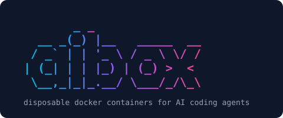

<p align="center">
  
</p>

<p align="center">
  <a href="https://github.com/vincemaina/aibox/actions/workflows/ci.yml"></a>
  <a href="./LICENSE"></a>
  <a href="https://www.python.org/downloads/"></a>
</p>

# aibox

`aibox` is a small Python CLI that launches a disposable Docker container from any local project directory. It is built for running Claude Code or another AI coding agent inside a sandbox where the agent can edit the current project files but cannot see your home directory, credentials, dbt profiles, Snowflake credentials, GitHub credentials, or your `.git` history.

## Why aibox

- **Your credentials stay invisible.** Your home directory is never mounted. No SSH keys, cloud credentials, dbt profiles, or `~/.aws` — the container simply cannot see them.
- **The agent can do real Git work.** It reads history, commits, and branches, so it can shape its work into a reviewable story. `--git readonly` or `--git masked` dial that back.
- **But it can't reach your remotes.** No `gh`, no SSH keys, no tokens — nothing to authenticate or push with. Protecting shared history is the remote's job: use branch protection.
- **And it can't make your Git run its code.** `.git/hooks` and `.git/config` stay frozen even when the agent can commit, so it can't plant a `pre-commit` hook or a malicious `core.pager` that would execute on your machine next time you use Git.
- **No Docker socket.** The container can't escape by talking to the daemon that runs it.
- **Runs as a non-root user** (`dev`) matched to your host UID/GID, so files you create in `/workspace` are owned by you, not by root.
- **Disposable by default.** The container is removed on exit (`--rm`). Nothing accumulates.
- **But your setup persists.** `/home/dev`, `/tmp`, `/var/tmp`, and `/opt` are per-project named volumes, so npm globals, shell history, and Claude config survive across sessions.
- **Per-project isolation.** Each project gets its own volume set, keyed by a stable hash of its absolute path. Two projects never share state.
- **Ready for Claude Code out of the box.** Ships with a current Node.js LTS (Claude Code needs `node >=22`), plus git, ripgrep, fd, jq, and build-essential.
- **The agent can see its own UI work.** Chromium's system libraries are in the image, so an agent can drive Playwright, screenshot the page it just built, and read the result back. See [Browser testing](#browser-testing).
- **Zero runtime dependencies.** Pure Python standard library, shelling out to the `docker` CLI. No SDKs to install or keep in sync.
- **Configurable per project.** An optional `.aibox.toml` adds ports, env vars, env files, a custom shell, or raw Docker arguments.
- **Templates for your working practices.** Keep your `CLAUDE.md`, best practices, and skills in one template repo and seed every project from it — merged in, never silently overwritten. See [Templates](#templates).

The mental model:

- `/workspace` inside the container is a live bind mount of your project. Edit freely.
- `/home/dev`, `/tmp`, `/var/tmp`, `/opt` are per-project named volumes that persist across runs.
- Everything else (your real home, ssh keys, cloud credentials, dbt profiles) is invisible to the container.
- `git` is installed and the agent can commit to your real history by default, but the GitHub CLI (`gh`) is not installed and no credentials are mounted — so it can't push to or authenticate against your remotes.

## Requirements

- **OS**: macOS, Linux, or Windows. See [Platform notes](#platform-notes) below for the practical differences.
- **Python 3.11+**
- **Docker installed and running.** `aibox` shells out to the `docker` CLI; it won't start a container if Docker isn't available. Verify with `docker version`.

### Platform notes

| Platform | Docker option | Notes |
|----------|--------------|-------|
| **macOS** | [Docker Desktop](https://www.docker.com/products/docker-desktop/) | Tested. Bind-mount ownership is translated transparently. |
| **Linux** | Docker Engine (or Desktop) | Tested. The container's `dev` user is retuned at startup to match your host UID/GID via an entrypoint script, so files you create in `/workspace` are owned by you on the host. |
| **Windows** | [Docker Desktop](https://www.docker.com/products/docker-desktop/) **or** WSL2 + Docker Engine | Docker Desktop on Windows is paid for commercial use over a certain company size. WSL2 + Docker Engine is a free alternative — install Docker Engine inside a WSL2 distro and run `aibox` from inside WSL. |

On Linux, Docker Engine only accepts connections from members of the `docker` group. If `aibox` reports a permission error, add yourself and start a new login session:

```bash
sudo usermod -aG docker $USER   # then log out and back in
```

Note that `docker` group membership is effectively root-level access on the host.

Podman is **not** currently supported — its rootless UID mapping, SELinux labelling, and `tmpcopyup` behaviour all differ from Docker in ways that would silently unmask `.git`. See [`plans/phase-8-podman.md`](./plans/phase-8-podman.md). Fedora and RHEL users should install Docker Engine.

## Install

Make sure Docker is running first. Then install `aibox` globally with [pipx](https://pipx.pypa.io/) (recommended for CLI tools):

```bash
pipx install -e .
```

Or with regular pip:

```bash
pip install -e .          # runtime only
pip install -e ".[dev]"   # with pytest (for development)
```

Either way, the `aibox` command becomes globally available.

## Basic usage

From any project directory:

```bash
cd ~/projects/my-project
aibox
```

That:

1. Resolves a stable project ID from the folder name plus an 8-character hash of the absolute path.
2. Builds the default Docker image (`aibox-default:latest`) if it doesn't exist yet.
3. Starts an interactive container with the project bind-mounted at `/workspace`.
4. Applies the [Git access](#git-access) mode (only when the host has a `.git` directory).
5. Drops you into `/bin/bash` as the `dev` user.
6. Removes the container when you exit. Volumes survive.

The same project always uses the same set of persistent volumes, so npm globals, shell history, Claude config, and anything under `/opt` carry across sessions.

## Commands

```bash
aibox                  # equivalent to `aibox run`
aibox run              # start an interactive container
aibox init             # seed this project from your template(s)
aibox setup            # configure your templates (runs on first use)
aibox info             # print project paths, IDs, image, container, volume names
aibox remove-volume    # delete the 4 persistent volumes for this project (prompts)
aibox remove-volume --force
aibox rebuild-image    # rebuild aibox-default:latest
```

### `aibox run` flags

| Flag                                | Purpose                                                  |
|-------------------------------------|----------------------------------------------------------|
| `-p`, `--port HOST:CONTAINER`       | Publish a port. Repeatable.                              |
| `-e`, `--env KEY=VALUE`             | Set an environment variable. Repeatable.                 |
| `--env-file PATH`                   | Pass a `--env-file` to Docker. Repeatable.               |
| `--shell PATH`                      | Override the default `/bin/bash`.                        |
| `--git {commit,readonly,masked}`    | How much of the host `.git` the agent gets. See [Git access](#git-access). |
| `--docker-arg=ARG`                  | Raw passthrough to `docker run`. See note below.         |
| `--user USER`                       | Run as a different user inside the container.            |

**Note on `--docker-arg`:** when the value starts with `--`, use the `=` form (`--docker-arg=--add-host=host.docker.internal:host-gateway`). This is an argparse quirk, not an aibox bug.

## What gets mounted

| Host path                  | Container path  | Kind            |
|----------------------------|-----------------|-----------------|
| current working directory  | `/workspace`    | bind mount (live) |
| `aibox-home-{project-id}`  | `/home/dev`     | named volume    |
| `aibox-tmp-{project-id}`   | `/tmp`          | named volume    |
| `aibox-var-tmp-{project-id}` | `/var/tmp`    | named volume    |
| `aibox-opt-{project-id}`   | `/opt`          | named volume    |

If a `.git` directory exists on the host, extra mounts are layered on top of it according to the selected [Git access](#git-access) mode.

## What persists across runs

The four named volumes above. Use them for:

- `/home/dev` — agent config, memories, shell history, npm-global installs.
- `/tmp`, `/var/tmp` — work-in-progress scratch.
- `/opt` — additional tools the agent installs.

Everything else (the rest of `/`) is part of the image and reset every time the container starts.

## What does **not** persist

Everything outside the four volumes. The container is `--rm`, so changes to `/etc`, `/usr`, `/lib` etc. are gone on exit. Persistent system changes belong in the Dockerfile — rebuild the image with `aibox rebuild-image`.

## Git access

By default the agent can read your commit history and make commits and branches. That's deliberate: an agent that can shape its work into a clear sequence of commits produces something you can actually review, and it can read the project's history to pick up its conventions.

Three modes, via `--git` or `git` in `.aibox.toml`:

| Mode | Agent can | Use when |
|------|-----------|----------|
| `commit` *(default)* | read history, commit, branch, rebase | you want the agent to author its own history |
| `readonly` | read history only | you want context but will do all committing yourself |
| `masked` | nothing — `.git` appears empty | maximum paranoia, or a repo you don't want touched |

**What no mode allows.** Two things stay locked down even in `commit` mode, because Git runs them *on your machine*, as you, the next time you use it:

- **`.git/hooks/`** is replaced with an empty read-only tmpfs. The agent can't leave a `pre-commit` hook behind that fires when you next commit from your IDE.
- **`.git/config`** is re-mounted read-only. It can name commands via `core.pager`, `core.sshCommand`, `filter.*.clean`, `diff.*.textconv` and more — all of which host Git would execute.

Both protections extend to submodule git directories under `.git/modules/`. The side effect is that `git config` and `git remote add` don't work inside the container; the agent can still write its own `~/.gitconfig`, which lives on the per-project home volume.

**Commits are attributed to `aibox agent <agent@aibox.local>`** when the repo doesn't set an identity of its own, so sandbox commits are obvious in `git log`. Override with `--env GIT_AUTHOR_NAME=...` (and the matching `GIT_AUTHOR_EMAIL` / `GIT_COMMITTER_*`).

### The agent still can't reach your remotes

`git` is in the image because agents legitimately need it — cloning public repos, installing Claude Code plugins and marketplaces, pulling reference code. What's absent:

- **No GitHub CLI (`gh`)** — the tool most geared toward authenticated remote operations.
- **No credentials** — no SSH keys, no GitHub tokens, no host `~/.gitconfig`.

So the agent commits locally and that's where it stops. **Protecting shared history is the remote's job** — use branch protection rules, and keep repos private. If a local commit turns out to be wrong, it's recoverable from the remote or the reflog.

## Templates

If every project of yours wants the same agent guidance — a `CLAUDE.md`, your working practices, your skills — put it in a template repo once and seed from it.

### First run

The first time you use aibox, it asks:

```
  Welcome to aibox

  Templates seed every project with your own agent guidance —
  a CLAUDE.md, your working practices, your skills — so you don't
  set them up by hand each time.

  Template repo URL or local path (Enter to skip): https://github.com/you/claude-starter

  Fetching…
    workspace/  3 file(s)  → merged into your projects
    home/       1 file(s)  → loaded into the container
  Added.
```

It checks the layout as it goes. A template with neither a `workspace/` nor a `home/` directory would silently do nothing, so aibox says so, shows the expected structure, lists what it found at the top level instead, and links to the guide.

Press Enter to skip; it won't ask again. Run `aibox setup` any time to change your templates.

Then in a project that doesn't have your template files yet:

```
  This project doesn't have your template files yet.
  3 file(s) would be added. Nothing existing is overwritten.
  Import them? [Y]es  [n]ot now  [never]:
```

`not now` asks again next time. `never` records that choice for this project only, in `~/.local/state/aibox/projects.json`. The offer never appears when there's nothing new to add, when you have no templates, or when there's no terminal — so scripts and CI are unaffected.

### Configuration

Setup writes `~/.config/aibox/config.toml`; you can also edit it directly:

```toml
templates = [
  "https://github.com/you/claude-starter",
  "~/dotfiles/aibox-template",     # local paths work too
]
```

They're applied in order, so you can layer a general starter with a language-specific one. A project's `.aibox.toml` can override the list, and `templates = []` opts a project out entirely.

### Template layout

A template has up to two top-level directories, which are treated very differently:

```
your-template/
├── workspace/          → merged into your project by `aibox init`
│   ├── CLAUDE.md
│   ├── claude-best-practices.md
│   └── .aibox.toml
└── home/               → synced into the container on every `aibox run`
    └── .claude/skills/
```

- **`workspace/`** is repo guidance. It gets committed, so collaborators and Claude running on your host see it too. This is your source tree, so `aibox init` never overwrites anything without asking, and `aibox run` never touches it at all.
- **`home/`** is your personal agent tooling. It lands on the container's per-project home volume, where Claude picks it up as `~/.claude/skills/` — and **never appears in your repo**. Because that volume is disposable aibox state rather than your code, it refreshes on every run without asking.

Both are optional; a template can provide just one.

### The built-in agent briefing

Every box is seeded with an orientation document at `~/.claude/CLAUDE.md`, which agents read as user-level memory. You don't configure anything; it's always there.

It exists because an agent's default assumption is that your machine is its machine. Without it, agents burn turns hunting for an SSH key you told them about, retrying `git push` against a remote they can't authenticate to, or trying to "fix" a read-only `.git/config`. The briefing explains:

- **Where it is** — a disposable container; `/workspace` is a live mount of one real project; which paths persist.
- **That your machine is not its machine** — if you say "my key is at `~/.ssh/id_ed25519`", that file genuinely isn't there. It's told to say so rather than search for it or ask you to paste a secret.
- **What won't work and why** — `git push`, `gh`, `git config`, `.git/hooks`, `apt-get`. Including that the Git restrictions are host protections, not bugs to route around.
- **What it can do** — commit and branch freely, clone public repos, install packages, drive Chromium.
- **Hard rules** — never attempt to escape the sandbox, never touch files outside `/workspace`, never work on another repo, never push to `main`/`master`, never try to defeat a protection. A blocked action is a boundary to report, not an obstacle to work around.

The source is [`src/aibox/image/agent-briefing.md`](./src/aibox/image/agent-briefing.md). A template that provides its own `home/.claude/CLAUDE.md` replaces it — if you do that, carry the guidance across.

### `aibox init`

```bash
aibox init                       # merge workspace/ into this project
aibox init --dry-run             # show the plan, write nothing
aibox init --template ~/my-tpl   # ignore config, use this template
aibox init --refresh             # re-clone cached remote templates
```

New files are just created. A file that already exists and **matches** the template is left alone and reported as unchanged. A file that exists and **differs** is a conflict, and by default you're asked:

```
  CLAUDE.md already exists and differs.
    [k] keep mine  [r] replace  [b] keep both  [d] diff >
```

`keep both` writes the template's copy as `CLAUDE.aibox.md` so you can merge by hand. For scripts and CI, `--on-conflict {ask,skip,replace,keep-both}` forces a policy, and `--yes` is shorthand for `skip`. When stdin isn't a terminal aibox falls back to `skip` and says so, rather than hanging on a prompt nobody can answer.

Files you choose to keep are re-reported next time, since they still differ from the template — that's the point. Use `--yes` if you'd rather not hear about it.

## Browser testing

An agent can check its own front-end work by driving a real browser and looking at the result.

The image carries Chromium's system libraries (the part that needs root, so it can't be installed from inside the container). The browser itself is installed on demand:

```bash
npx playwright install chromium   # once per project; caches to the home volume
npm i playwright
```

Then the loop is: navigate, screenshot into `/workspace`, read the PNG back.

```js
const { chromium } = require('playwright');
const browser = await chromium.launch();          // headless
const page = await browser.newPage();
await page.goto('http://localhost:3000');
await page.screenshot({ path: 'screenshot.png' });
```

The agent then reads `screenshot.png` — that's how it "sees" the page. **No GUI is involved, and none is needed**; Claude reads image files directly.

To look at the app yourself, publish its port (`ports = ["3000:3000"]` in `.aibox.toml`) and open it in your own browser.

Notes:

- Browsers cache to `~/.cache/ms-playwright` on the per-project home volume, so the download happens once per project, not once per session.
- Chromium only. Firefox and WebKit need their own system libraries, which aren't installed.
- Heavy pages can exhaust Docker's default 64 MB `/dev/shm`. Playwright already passes `--disable-dev-shm-usage`; if you still hit crashes, add `docker_args = ["--shm-size=1g"]`.

## Why host credentials aren't mounted

The container only sees `/workspace` and its four named volumes. Specifically, it does **not** see:

- `~/.ssh`
- `~/.dbt`, `profiles.yml`
- Snowflake credentials
- GitHub credentials, gh tokens
- AWS, GCP, Azure credential folders
- The Docker socket

This is particularly important for dbt and data projects: the agent can edit your project files without being able to query your warehouse.

## `.aibox.toml`

Optional, lives in the project root. CLI flags compose with it:

- list fields (`ports`, `env`, `env_files`, `docker_args`) — CLI appends to config.
- `shell` — CLI `--shell` overrides config.
- `git` — CLI `--git` overrides config.
- `templates` — overrides the user-level list entirely; `[]` opts out. See [Templates](#templates).
- `user` — comes from CLI only.

Example:

```toml
ports = ["3000:3000", "8000:8000"]

env = [
  "NODE_ENV=development",
]

env_files = [
  ".env",
]

shell = "/bin/bash"

# "commit" (default) | "readonly" | "masked"
git = "commit"

docker_args = [
  "--add-host=host.docker.internal:host-gateway",
]
```

`aibox` will not create this file automatically. It's optional.

## Removing a project's volumes

```bash
aibox remove-volume          # prompts before deleting
aibox remove-volume --force
```

This deletes only the volumes for the current project. Other projects' volumes are untouched.

## Rebuilding the image

```bash
aibox rebuild-image
```

Run this after changing the Dockerfile, or whenever you want to refresh the base image. All projects share the same `aibox-default:latest` image.

## Known limitations

- **Symlinked project directories are not tested cross-platform.** They likely work on macOS and Linux as-is. Behaviour on Windows (junction points vs symlinks, and symlinks that cross between WSL and Windows paths) is unverified. File an issue if you hit something.

## Non-goals

For the MVP, aibox deliberately does not support:

- Docker Compose
- Custom images (one default image only)
- Mounting the Docker socket
- GitHub authentication (`gh`, tokens, SSH keys) — `git` itself is installed and the agent can commit locally, but it can't authenticate to remotes
- Installing Claude Code into the image (do that inside the container)
- Cloud credential mounting
- SSH key mounting
- Automatic port detection
- A background daemon
- Remote VM support
- Multi-agent orchestration
- UI/dashboard

See [`ROADMAP.md`](./ROADMAP.md) for future work and [`PROMPT.md`](./PROMPT.md) for the full specification.

## Contributing

See [`CONTRIBUTING.md`](./CONTRIBUTING.md) for development setup, test commands, and the repo layout.

For security issues, see [`SECURITY.md`](./SECURITY.md).

## License

[MIT](./LICENSE) © Vince Maina
